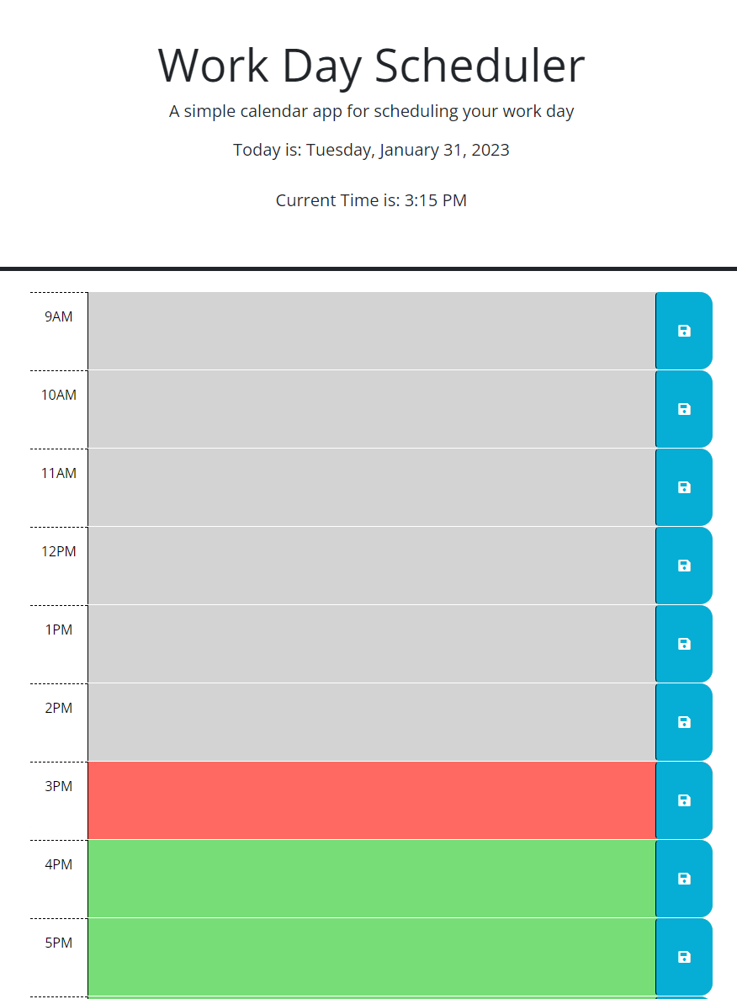

# work-schedule-manager

## About 
This is a work day scheduler it will highlight sections based on what time it is in the day to help determine what task is next in your schedule

## Function 
You can edit each block with a desciption of tasks you have throughout your day.
Then you can save that desciption by pressing the save button and it will persist when the page is reloaded.
The gray sections are sections of time that are in the past
The red sections are indicating the current hour tasks
The Green sections are future scheduled tasks

## ScreenShot  

## License 

MIT

## Citing Credit

 Web3 schools was used for referencing javascript elements while building this page!

 [https://www.w3schools.com/](doc:linking-to-reference#https://www.w3schools.com/)

 DayJS Was used to implement the times and dates involved in this project

 [https://day.js.org/](doc:linking-to-reference#https://day.js.org/)

 Jquery was used to select things on screen and reference the docs for other uses.

 [https://jquery.com/](doc:linking-to-reference#https://jquery.com/)
